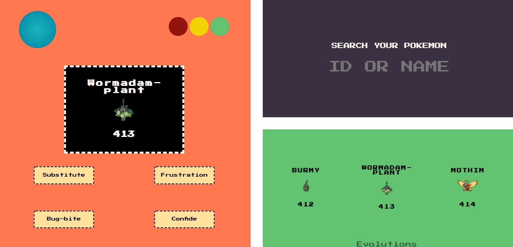

# Title: OOP: Blackjack Game
### PHP Exercise 02/11/2021
 

## Description
Pokedex with OOP (Object Oriented Programming).
 
 

## The Mission
Let's recreate our previous PHP Pokedex, but based on OOP.

 

  

## Pokedex
  - Working with [PokeAPI][https://pokeapi.co/].
  - Interaction with the user.
  - Displaying basic information.
  - Displaying evolution information.
  - No valid inputs will display error message.

 

## To Do

- [ ] Implement classes.
- [ ] Add methods and logic in them.
- [ ] "index.php" config
    - [ ] Require all the files with the classes.
- [ ] Style file.
- [ ] Create messages components.
