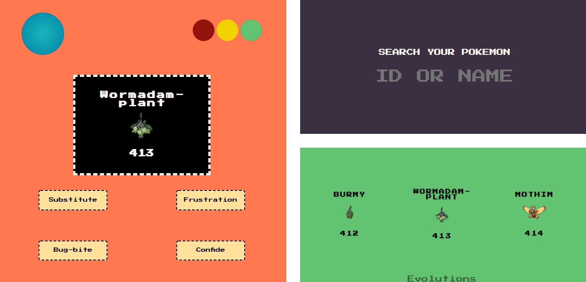

# Title: OOP: Blackjack Game
### PHP Exercise 02/11/2021

## Description
Pokedex with OOP (Object Oriented Programming).

## The Mission
Recreating my previous PHP Pokedex, but based on OOP.

## Features
  - Working with [PokeAPI][api].
  - Interaction with the user.
  - Displaying basic information.
  - Displaying evolution information.
  - Fixed exceptions (API information).
  - No valid inputs will display error message.

## To Do

- [ ] Implement more OOP concepts in the project.

[api]: https://pokeapi.co/
